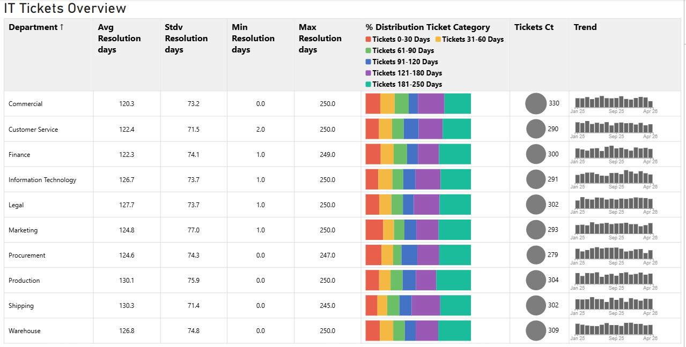

# Sparkline Trend Table (Power BI Custom Visual)

A high-performance Power BI custom visual developed with **D3.js** and **TypeScript**. This visual allows users to view trend sparklines alongside tabular data for immediate context on performance metrics.

## Overview
The **Sparkline Trend Table** is a highly optimized, custom-built Power BI matrix visual. It seamlessly integrates summary metrics, percentage-based composition stacked bars, magnitude bubbles, and time-series bar sparklines into a single, unified view. 

Unlike standard visuals that struggle with conflicting data grains, this visual is architected to natively process Power BI Subtotals to deliver true mathematical averages alongside month-by-month trend data without duplicating columns.

## Features
* **Double-Duty Measures:** Use the exact same measure for your summary metrics and your sparkline trends. The internal parser deduplicates roles and routes data accurately to prevent "ghost" columns.
* **Native Subtotal Integration:** Leverages Power BI's native matrix subtotals to guarantee 100% accurate grand totals (avoiding "average-of-averages" calculation errors).
* **Missing Data Alignment:** Automatically compiles a master timeline axis. If a row is missing data for a specific month, the visual safely renders a blank space, ensuring perfect vertical alignment for all sparklines.
* **Unified Stacked Bar Tooltips:** Hovering anywhere over a stacked bar cell reveals a comprehensive tooltip detailing the absolute values and percentages of all segments simultaneously.
* **Dynamic Formatting:** Highly customizable via the Power BI Formatting Pane, including conditional X-Axis rendering, adjustable bar padding, and granular text formatting.

## Data Roles
To use the visual, drag fields into the following buckets:
1. **Category:** The primary row label (e.g., `Department`).
2. **Metric Columns:** Measures to display as standard aggregated metrics (e.g., `Avgerage Days`).
3. **Stacked Bar Segments:** Measures that formulate the horizontal composition bar.
4. **Bubble Size:** The measure determining the radius of the magnitude bubble.
5. **Sparkline Axis (Date):** The timeline dimension for the sparklines (e.g., `Date Created`).
6. **Sparkline Values:** The measure plotted on the bar sparklines.

## Installation (Internal Organization)
1. Download the latest `.pbiviz` package.
2. In Power BI Desktop, navigate to the **Visualizations** pane.
3. Click the `...` (More options) menu and select **Import a visual from a file**.
4. Select the `.pbiviz` file. The Sparkline Trend Table icon will appear in your pane, ready for use.

## Architecture Notes
This visual utilizes a **Single Matrix DataView Mapping**. 
To ensure performance and accuracy, it relies on the DAX engine's `"subtotals"` property. The TypeScript `dataParser.ts` intercepts the `isSubtotal` flag generated by Power BI, routing the exact grand total to the metric columns while dispersing the leaf-node arrays to the D3.js sparkline generator.